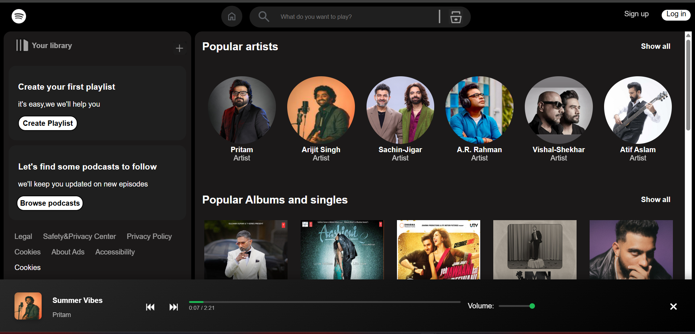

# 🎧 Spotify Clone - By Kapil Sehrawat

Welcome to my **Spotify Clone**! This is a front-end project built using only **HTML**, **CSS**, and **JavaScript**, designed to replicate the basic UI and functionality of the Spotify music player. It features a sleek, responsive design and allows users to interact with a custom music player interface.

🔗 **Live Demo:**  
👉 [Click here to check it out](https://kapilsehrawat2005.github.io/Spotify-Clone/)

---

## ✨ Features

- 🎵 Play songs
- ⏮️ ⏭️ **Previous / Next** song navigation
- 📃 **Song list** with cover art, name, and artist
- 📊 **Progress bar** with dynamic update and seek feature
- 🔊 **Volume control** with speaker icon
- 🖼️ **Song info display** with image and metadata
- 📱 **Responsive layout** — works on both desktop and mobile
- ❌ **Hide player** functionality with close button
* Note - This can play only one music file. If you want to listen to dynamic songs, please visit: [Spotify](https://open.spotify.com/)


---

## 🛠️ Built With

- **HTML** – Page structure and content
- **CSS** – Layout, design, responsiveness
- **JavaScript** –  music player logic
- **GitHub Pages** – Deployment platform

---

## 🖼️ Screenshots


| Music Player |
|  |

---

## 📦 Getting Started (Run Locally)

To run this project on your local machine:

1. Clone the repository:
   ```bash
   git clone https://github.com/KapilSehrawat2005/Spotify-Clone.git
   ```

2. Navigate into the project directory:
   ```bash
   cd Spotify-Clone
   ```

3. Open `index.html` in your preferred browser.

That’s it! 🎉

---

## 📬 Connect With Me

If you have any feedback or suggestions, feel free to connect:

- 📧 Email: [kapilsehrawat022003@gmail.com](mailto:kapilsehrawat022003@gmail.com)
- 🔗 LinkedIn: [Kapil Sehrawat](https://www.linkedin.com/in/kapil-sehrawat-318814288)
- 💻 GitHub: [KapilSehrawat2005](https://github.com/KapilSehrawat2005)


---

> 🚀 Created with passion and practice by **Kapil Sehrawat**  
> 📌 For educational and demonstration purposes only. Not affiliated with Spotify.
